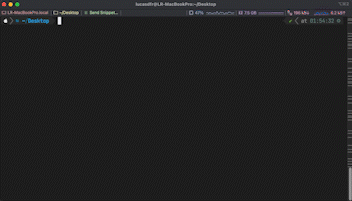
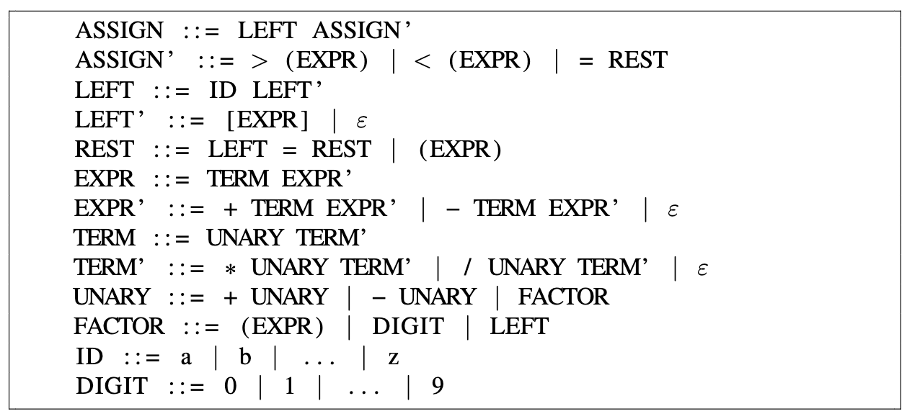

# Compiladores - Trabalho 01

> Trabalho 01 da disciplina de Compiladores, no Semestre 2022.2 da UFOPA, feito por Fellype Barroso e Lucas
> Rodrigues.

---

### 📂 Códigos e pastas

- `Assets/`: contém os documentos adicionais relacionados ao Trabalho - como exemplos válidos para a gramática associada
  à equipe e o PDF com a adaptação da mesma para LL(1), com os exemplos e árvore de derivação.
- `Trabalho_01/`: contém o código-fonte para o Parser desenvolvido com base no `IParser` disponibilizado no PDF
  descritivo do Trabalho 01.

---

### 🚀 Sobre o código-fonte e como executar

O código-fonte foi desenvolvido na Linguagem Python - versão 3.10. Por solicitação do Professor Efren, foi mantida a
estrutura de `interface` (com o uso do `abc.ABCMeta`) que seria existente em uma versão Java do código. As devidas
adaptações foram implementadas em Python para seguir esse requerimento.

#### 1. Clonar o repositório na branch do trabalho

> Se o SSH estiver configurado em sua máquina, recomenda-se a execução do comando abaixo via SSH.

~~~bash
git clone https://github.com/NepZR/compiladores-ufopa.git -b "feat/trabalho_1"
~~~

~~~bash
git clone git@github.com:NepZR/compiladores-ufopa.git -b "feat/trabalho_1"
~~~

#### 2. Acessar a pasta do código-fonte (`Parser`)

~~~bash
cd compiladores-ufopa/Trabalho_01/parser
~~~

#### 3. Executar o `Parser` no arquivo `Parser.py`

~~~bash
python3 -u Parser.py
~~~

#### 4. Ao aparecer "Test String: " no terminal, digite ou cole a `string` de teste e confirme (`Enter`)

#### 5. Dependendo da `string`, será exibida uma mensagem de sucesso ou o `Parser` indicará um erro sintático com a coluna em que ocorreu.

---

### 🚀 Gramática `LL(1)` implementada

#### Exemplos válidos para a gramática acima:

- `a < ( ( a + b ) * ( c - d ) )`
- `b > ( 5 + a - b * ( c / 8 ) )`
- `d = ( ( a / b ) * ( c * 9 ) * a [ y ] )`
- `c [ 2 ] = ( ( a + b + c ) * c [ 1 ] )`
- `a = b = c = d = ( ( ( a * 3 ) + a [ 1 ] ) / b * 3 )`

---

<h3 style="text-align: justify;">
  👨🏻‍💻 Equipe 05
</h3>

<table style="display: flex;">
  <tr>
    <td align="center"><a href="https://github.com/fellypesb"> <b>Fellype Siqueira Barroso</b></a> <b>Software Development Student</a> <a href="https://www.linkedin.com/in/fellypesb"><b>LinkedIn (fellypesb)</b></a></td>
    <td align="center"><a href="https://github.com/NepZR"> <b>Lucas Darlindo Freitas Rodrigues</b></a> <b>Data Engineer | Python Dev.</a> <a href="https://www.linkedin.com/in/lucasdfr"><b>LinkedIn (lucasdfr)</b></a></td>
  </tr>
<table>